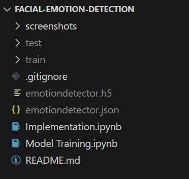

# Facial Emotion Detection

## Overview
Facial Emotion Detection is a project that utilizes image processing techniques and machine learning algorithms to detect facial emotions from images. It aims to provide a tool for analyzing human emotions based on facial expressions, which can have various applications in fields like psychology, market research, and human-computer interaction. The project recognizes facial expressions such as happy, sad, surprise, fear, disgust, angry, and neutral.

## Requirements
- Python 3
- OpenCV
- TensorFlow
- Keras
- NumPy
- Matplotlib
- pandas
- os

## Software Used
- Anaconda
- Jupyter Notebook

## Dataset
The project utilizes the FER2013 dataset, which can be found at [Kaggle](https://www.kaggle.com/datasets/msambare/fer2013). This dataset contains facial images categorized into seven different emotions: angry, disgust, fear, happy, neutral, sad, and surprise.

## Usage
1. Clone or download the repository.
2. Install the required dependencies listed in the Requirements section.
3. Download the dataset from [Kaggle](https://www.kaggle.com/datasets/msambare/fer2013) and save the train and test folders in the project root directory.
4. Run the `Model Training.ipynb` notebook using Jupyter Notebook to train the model.
5. After training, two files will be created: `emotiondetector.json` (containing the model architecture) and `emotiondetector.h5` (containing the model weights and configuration).
6. Load the trained model in the `Implementation.ipynb` notebook and use it to perform facial emotion detection on static images by providing their file paths.

## Project Directory Structure
After model training, your project directory should resemble the screenshot below:

## Future Improvements
In the future, efforts will be made to improve the model's performance by:
- Exploring better-quality image datasets or augmenting the existing dataset to improve model generalization.
- Implementing real-time facial emotion detection by integrating the model with live video streams or webcam feeds.
